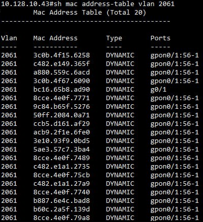
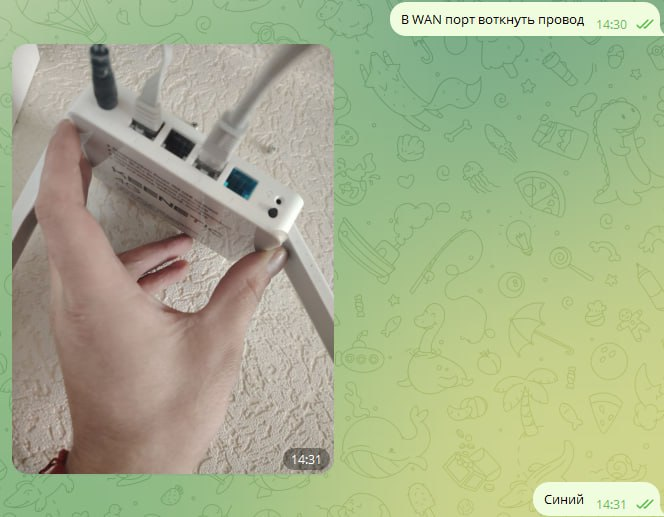

# ЧЗ? - часто задаваемые вопросы
#### 1 Автопрописывание
- подключить ону, дать загрузиться (погаснет красный сигнал при подключении к олт)
- уточнить bdcom или iscom olt установлена для определения нужно ли писать после RCMG двоеточие
- Воспользоваться ботом [бот](https://t.me/skynet_requests_bot)
- нет бота -> [файл с автопрописыванием](https://docs.google.com/document/d/1-8Df7WF6OTE0WjwXL1221KyvbWMdwVJnHPSNzHJYTwU/edit#bookmark=id.xmlpxytgw1gv)
#### 2 что если в течение первых пяти секунд после сохранения на сайте интернет не заработал
- проверить через пару минут состояние прописывания по кнопке `Показать логи регистрации ONU`(в заявке), если есть красные подписи написать техникам, в противном случае ждать 10 минут
#### 3 написано нет тарифа
- [прописать тариф](https://docs.google.com/document/d/1-8Df7WF6OTE0WjwXL1221KyvbWMdwVJnHPSNzHJYTwU/edit#bookmark=id.ugl17uq96b1r), один раз перезапустить прописывание после сохранения заявки [не тыкать больше одного раза](https://docs.google.com/document/d/1-8Df7WF6OTE0WjwXL1221KyvbWMdwVJnHPSNzHJYTwU/edit#bookmark=id.qa629vnbewi6)
#### 4 сразу после смены устройства подключенного к ону инет не появился
- ждать 10 минут, потом проверять
#### 5 скорость по спидтесту не по тарифу
- все точные замеры только по кабелю!!!
- при измерении по wifi посмотри на пункт выше, в зависимости от помех скорость может падать до 0, подключать ноутбук и замерять
- при сохранении проблемы, после замера ноутбуком по кабелю без роутера, написать техникам
#### 6 красный знак на ону не гаснет
- проверить сигнал по оптике, 
- сверить цвет коннектора с цветом входа ону
- поменять блок питания
- поменять ону
#### 7 как настроить роутер с симкой
- не все роутеры настраиваются, если есть убежденность в обратном, искать в интернете как переключить WAN порт
#### 8 техник говорит нет мака
- проверить что роутер включен
- проверить индикацию онушки
- если устройство клиентское, подключить ноутбук или наш роутер напрямую к ону для проверки
#### 9 техник говорит плохой сигнал
- [смотреть пункт 6](#6-красный-знак-на-ону-не-гаснет)
#### 10 техник говорит нет линка (медный порт лежит)
- нет физического соединения между роутером и ону (по медному кабелю), проверять кабель, ону, роутер
#### 11 "летит много маков с порта"
- кратко говоря, вместо одного устройства все клиентские обращаются к нам в сеть, чего быть не должно
- неправильная настройка роутера/коммутатора клиента, не в тот порт роутера подключен, неправильно настроен порт роутера с симкой (пункт 7).
как это видим мы

как это выглядит обычно

#### 12 настройка удаленного доступа
- [регламент](https://docs.google.com/document/d/1YebMgzoQbvzjj7svU7k92Vc4xmRYWehl/edit?usp=drive_link)
