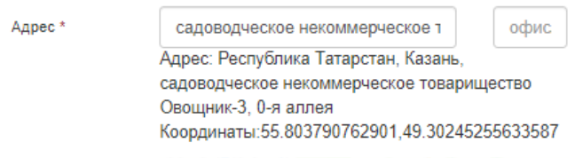
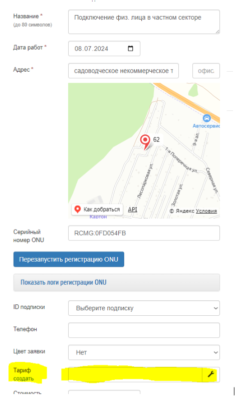
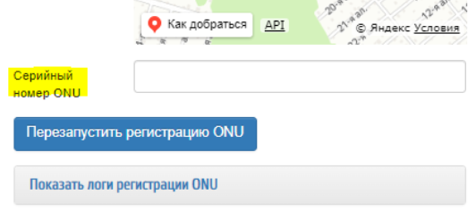

## Настал день и монтажники поехали в поселок для подключений наших клиентов. что же делать?

1. в первую очередь монтажник должен включить геолокацию, дабы наша карта поняла где он и смогла в будущем определить на какую олт ей стучаться (оно должно выглядеть как-то так вроде) \
 

2. если в заявке то нужно его прописать и нажать кнопку сохранить и обновить страницу с заявкой 
3. если в заявке не указан тариф, то пропишите его, после сохраните \

4. лишь после этого переходим к пункту \
5. в зависимости от того, какая олт, зависит то, как будет нужно прописать серийник \
если это бдком, то: RCMG:0F982078 (после букв RCMG **есть двоеточие**) \
если это райском, то: RCMG0F982078 (после букв RCMG **нет двоеточия**) 
6. монтажники должны прописать серийник ону в соответсвующее поле (если тип заявке НЕ подключение, то этого поля не будет) и нажать сохранить \

7. билингу нужно *пару минут* (от 5 до 10), чтобы создать подписку и прописать все на олт, так что ***НЕ НАДО*** тыкать в кнопку Перезагрузить регистрацию ону, просто подождите 
8. если что-то пошло не так, то можно нажать Показать логи регистрации ону и посмотреть что не так и что не нравится биллингу