# Вы подключили клиента и теперь надо отрисовать линк на карте. Как это сделать? 
- [Видео инструкция](#видео-инструкция)
- [Инструкция в виде текста](#инструкция-в-виде-текста)

### Видео инструкция
Видео инструкция залита на гугл диск, можете с ней ознакомиться по [ссылке](https://drive.google.com/drive/folders/109COCZ4ksPdu_gGp6o0IEdBnxkCkZuGq). Там два видео, смотреть в порядке часть 1 - часть 2.

### Инструкция в виде текста
1. Находите вашу ону на карте. Как это можно сделать?
    - либо по адресу
    - либо по номеру заявки
    - либо по номеру vlan, где его посмотреть? открываете вашу заявку - нажимаете на логин клиента (1) (рядом с номером договора), что бы перейти в его лк, и там у нужной подписки смотрите номер влана (2), копируете его
    - на карте в поиск вводите номер влана (3), нажимаете на Поиск, среди появившихся результатов находите своего клиента, тыкаете на него (4), после под ним должна появится строка с ip олт и номером ону (5), нажимаете туда \
    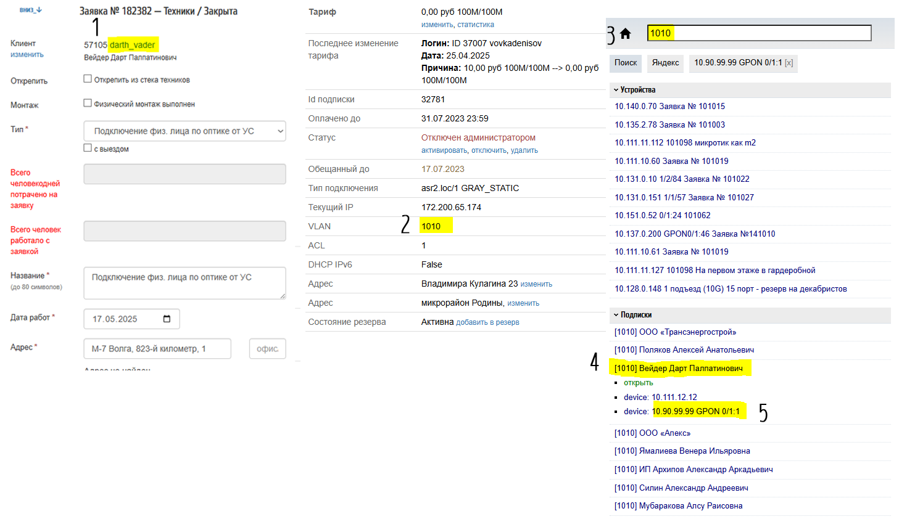 
    - карта должна перекинуть вас на эту ону на карте
2. Итак, вы нашли вашу ону, что делать дальше? \
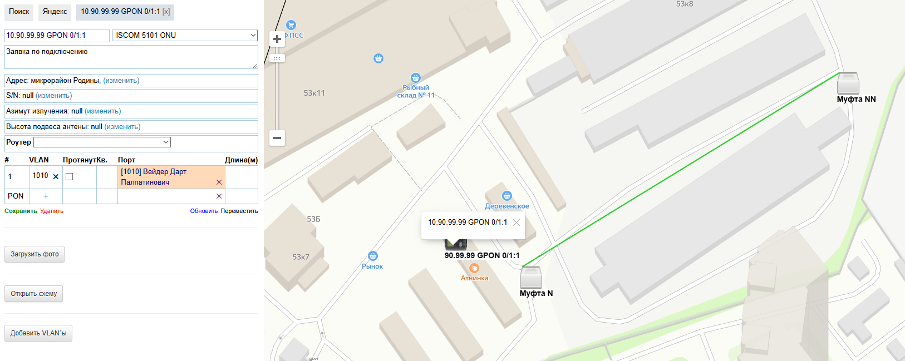
3. Для того, что бы рисовать как проложена оптика, в первую очередь надо что бы ваша ону и муфта были соеденины. Для этого нужно сделать следующее:
    - копируете полностью номер ону \
    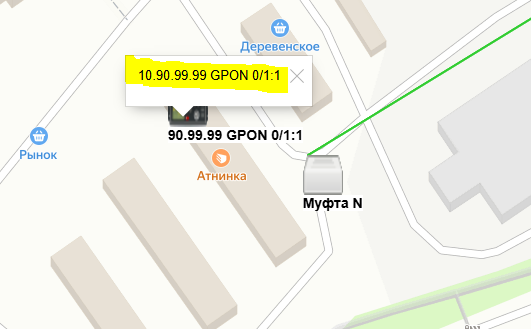
    - нажимаем на муфту, от которой она запитана (6), и вставляем номер ону (7)
    - немного ждем, когда появится окошко ниже, и там выбираем вашу ону (убедитесь, что выбрали верно) \
    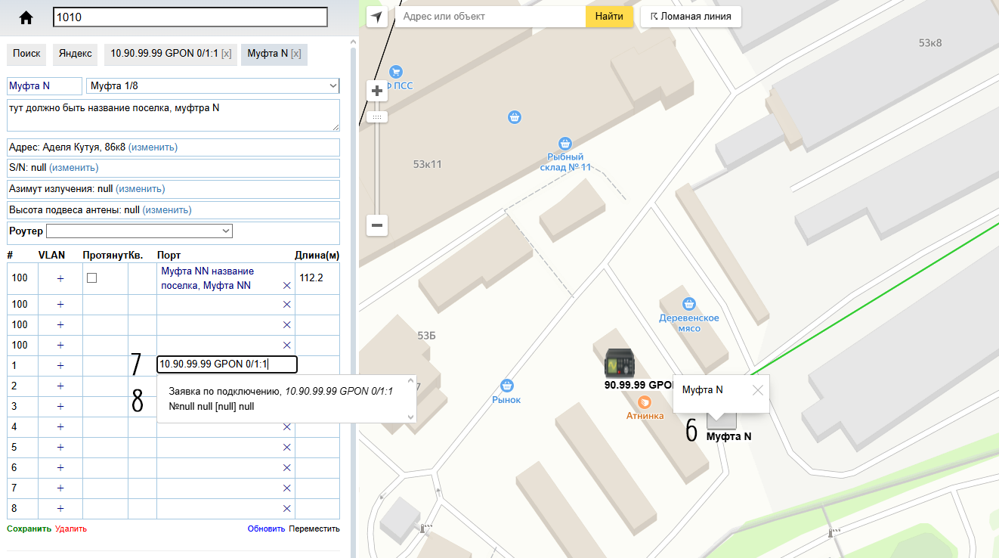
    - после появится красный линк между ону и муфтой/делителем \
    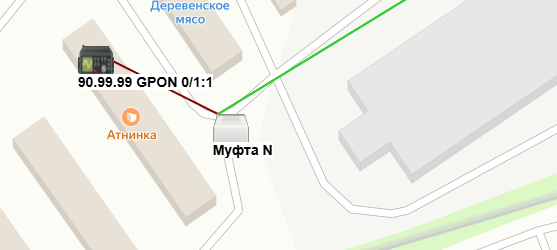
    - делаем то же самое, но теперь копируем номер муфты (8), и вставляем его в онушку (9)
    - так же немного ждем когда появтятся муфты, но, так как муфты у нас есть в разных поселках, у вас появтятся муфты со всех поселков с таким названием, однако в комментарии к муфте должен быть указан поселок, поэтому в появившемся списке найдите муфту с названием ВАШЕГО поселка (поэтому 
    ВАЖНО писать в комментариях к муфте поселек) \
    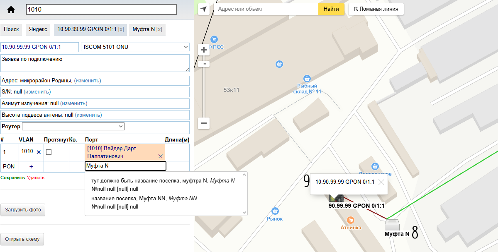
    - после линк между ону и муфтой станет зеленым \
    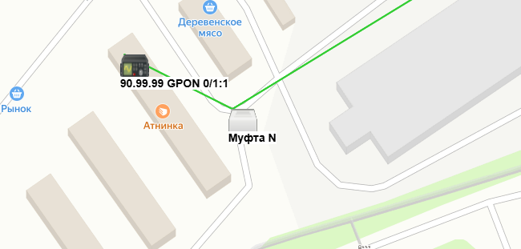
4. После этого можно приступать к рисованию линка на карте. Как это сделать?
    - в первую очередь нажимаем на Ломанная линая \
    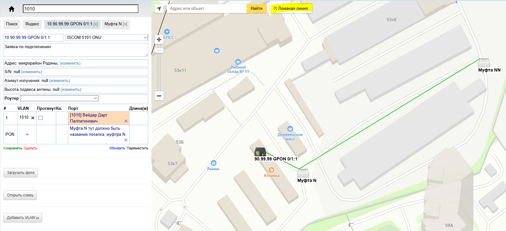
    - слевой части экрана появится инструкция, будем следовать ей \
    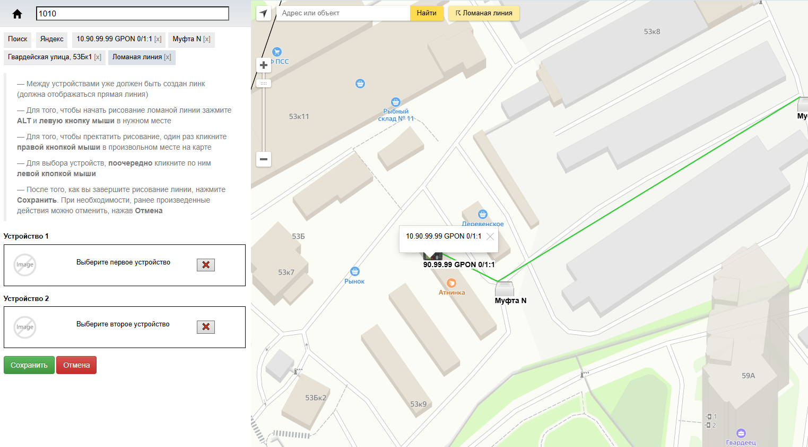
    - сначала нужно выбрать поочередно наши устройства: поочередно кликаем по ним левой кпопкой мыши \
    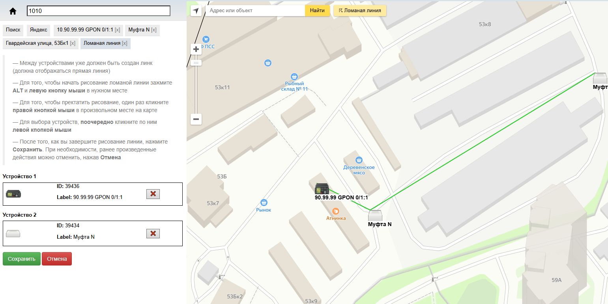
    - для того, что бы начать рисование ломаной линии зажимаем ALT и кликаем левой кнопкой мыши в нужном месте (например на муфту, что б начать рисовать с нее)
    - далее, отпустите ALT, увидите, что за мышкой идет розовая пункитрная линия от муфты (или ону, смотря на что вы нажали) \
    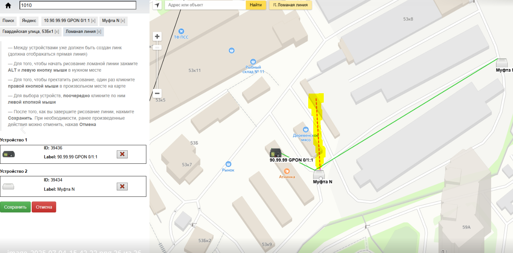 
    - ею кликаете по местам на карте, в том виде, как идет оптика \
    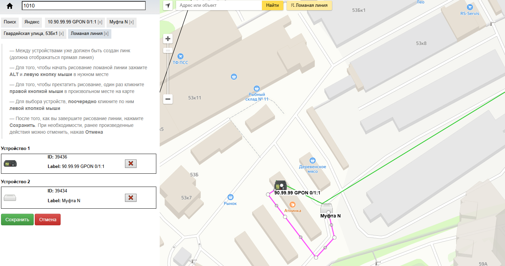
    - когда дойдете до онушки (нажмите на нее, что б линк дошел до нее), один раз кликаем правой кнопкой мыши в произвольном месте на карте, для того что бы прекратить рисование
    - если вы что-то нарисовали не так, то можете поправить линию
    - после чего нажимайте сохранить \
    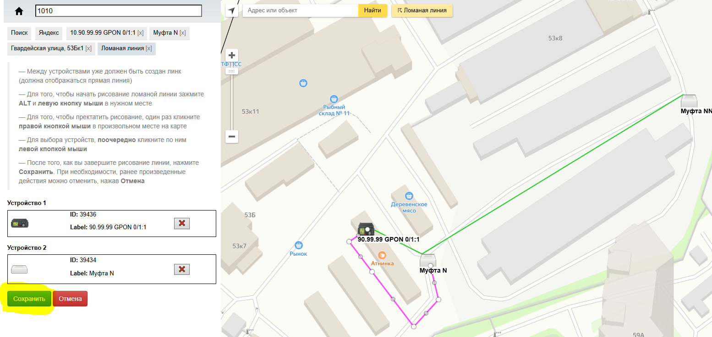
    - ожидаете пару мгновений и линия меняет свой вид \
    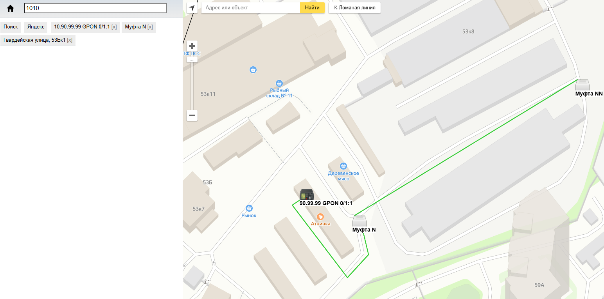
    - на этом все! 