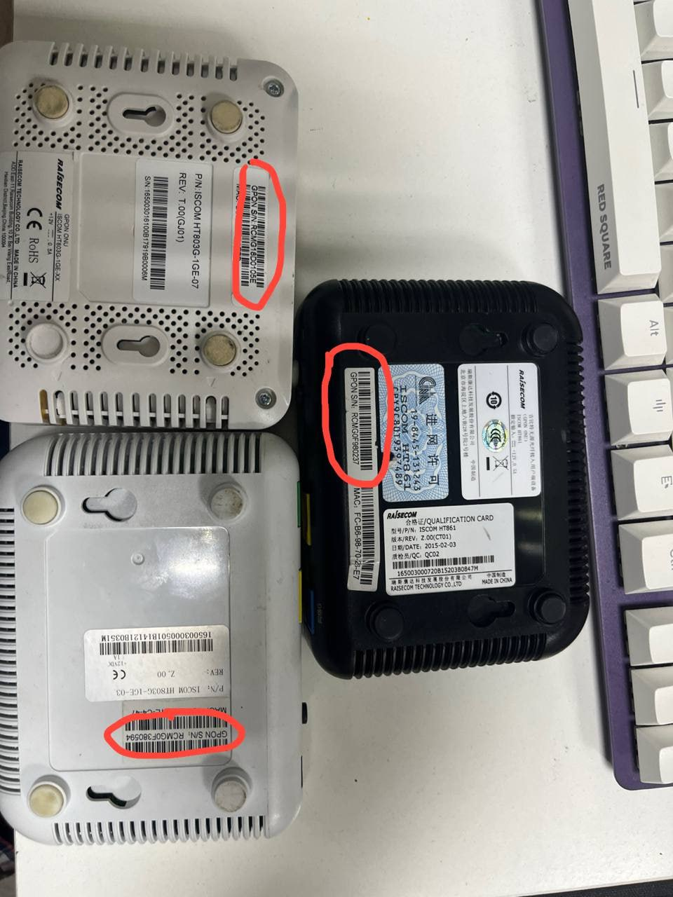
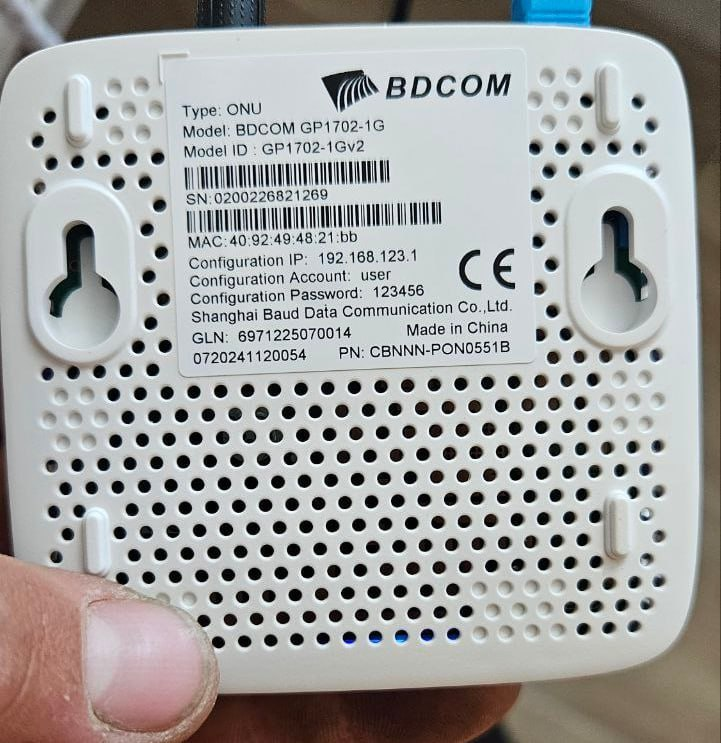
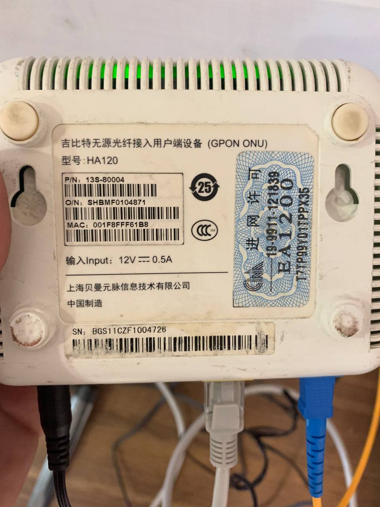
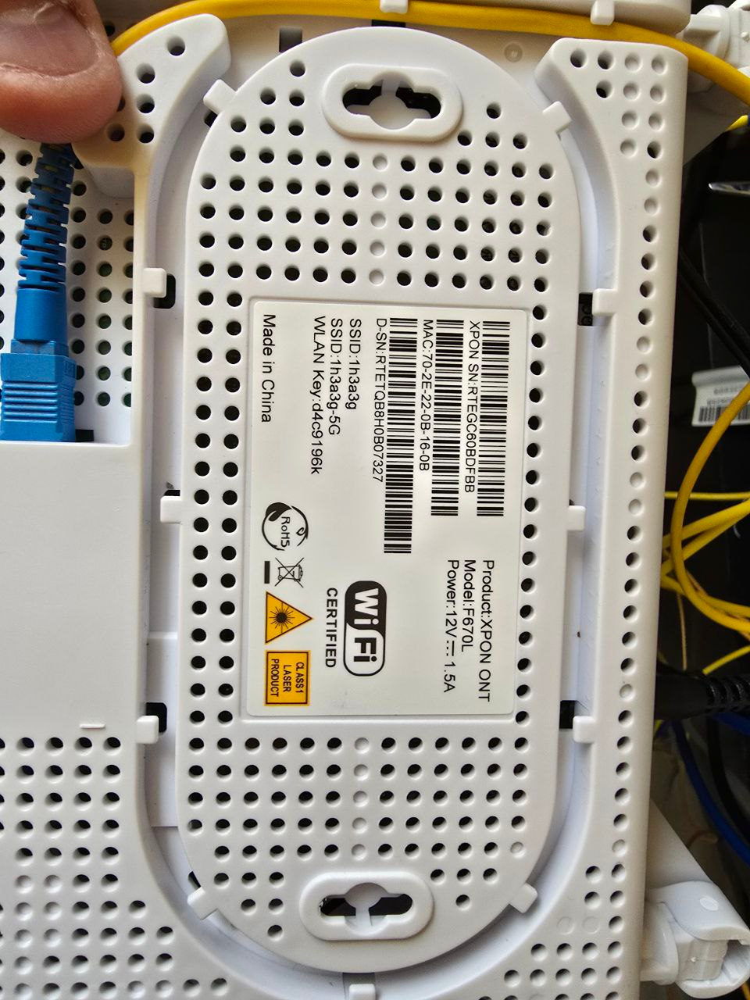

У нас есть множество онушек и олт. Что куда можно подключать, а что нет, опишем тут. 

двоеточие после RCMG ставится если олт БДКОМ\
если это РАЙСКОМ, то не ставится двоеточие\
если это ЗТЕ, то не ставится двоеточие

олт РАЙСКОМ НЕ ПЕРЕВАРИВАЕТ ОНУ БДКОМ\
ону ЗТЕ ВКЛЮЧАЕМ ТОЛЬКО В ОЛТ ЗТЕ

* ону raisecom ht803/861 используется sn (выделен красным)

* ону bdcom gp1702-1Gv2 используется mac с заменой первых четырех цифр/букв на BDCM. прим с фото BDCM:494821BB

* ону ea1200, здесь нужно вводить SHBM:F0104871 (на наклейке это O/N:)

* ону зте XPON ONT F670L, вводится RTEGC60B80A7 (в строке XPON SN:)

