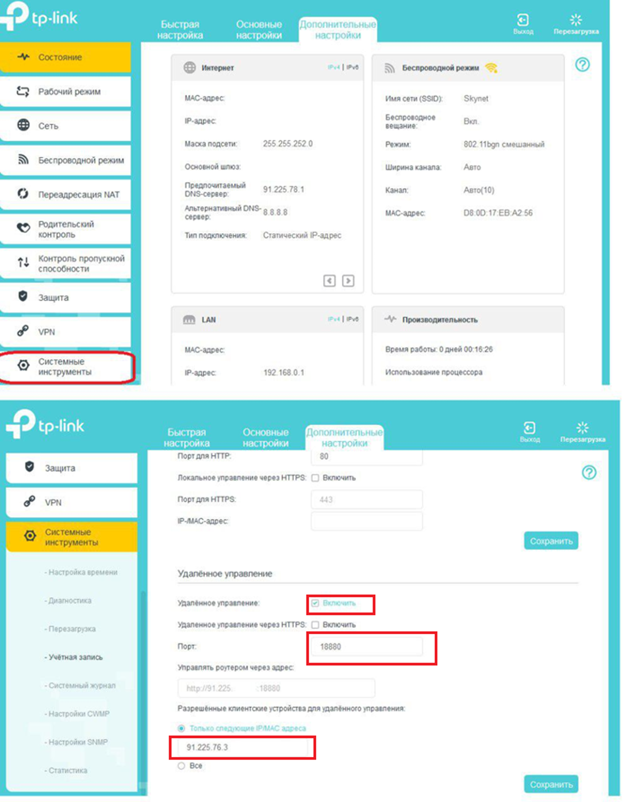
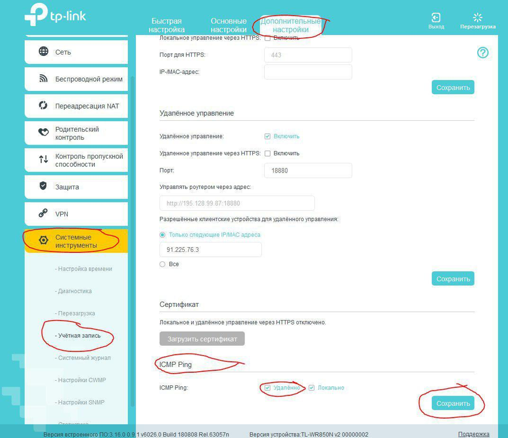

# Настройка удаленного доступа

- [Удаленка TP-link (новая прошивка)](#удаленка-tp-link-новая-прошивка)
- - [Разрешаем входящий ping](#разрешаем-входящий-ping-новая-прошивка)
- [Удаленка TP-link (старая прошивка)](#удаленка-tp-link-старая-прошивка)
- - [Разрешаем входящий ping](#разрешаем-входящий-ping-старая-прошивка)
- [Удаленка DIR-300](#удаленка-dir-300)
- - [Разрешаем входящий ping](#разрешаем-входящий-ping-dir-300)
- [Удаленка DIR-615](#удаленка-dir-615)
- [Удаленка Zixel](#удаленка-zixel)
- [Удаленка Keenetic ac 750](#удаленка-keenetic-ac-750)
- [Удаленка MikroTik](#удаленка-mikrotik)
- [Удаленка ASUS](#удаленка-asus)
- [Удаленка Mercusis](#удаленка-mercusis)
- [Удаленка Mercusis ac750](#удаленка-mercusis-ac750)
- [Удаленка на Tenda as1200](#удаленка-на-tenda-as1200)
- [Удаленка на Tenda n630](#удаленка-на-tenda-n630)
- - [Открытие пингов](#открытие-пингов)
- [Удаленка на Tenda n300](#удаленка-на-tenda-n300)

### Удаленка TP-link (новая прошивка) 

#### Разрешаем входящий ping новая прошивка

### Удаленка TP-link (старая прошивка) 

#### Разрешаем входящий ping старая прошивка

### Удаленка DIR-300
 

#### Разрешаем входящий ping DIR-300

### Удаленка DIR-615

### Удаленка Zixel

### Удаленка Keenetic ac 750
Сетевые правила – Переадресация>Добавить правило \
 \
Сетевые правила – Межсетевой экран>Добавить правило \
 \
Управление – Пользователи и доступ \

### Удаленка MikroTik
IP – Firewall  \

### Удаленка ASUS

### Удаленка Mercusis

### Удаленка Mercusis ac750

### Удаленка на Tenda as1200
* Прошивку не обновляем 

### Удаленка на Tenda n630

#### Открытие пингов

### Удаленка на Tenda n300
