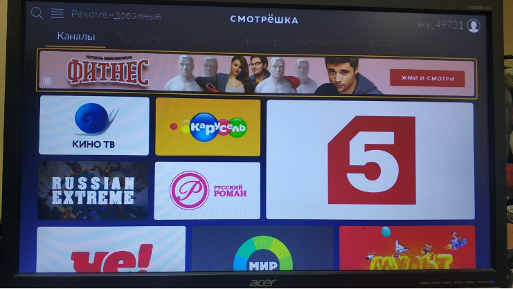

# Установка приложений тв на смарт тв или приставку.

### ТВ приставки и смарт тв подключаются только по Ethernet-кабелю, чтобы обеспечить стабильное подключение и качество передачи сигнала.
- [Установка приложения Смотрешка](#установка-приложения-смотрешка)
- [Установка приложения TVIP Media](#установка-приложения-tvip-media)
- [Как установить приложение с флешки](#как-установить-приложение-с-флешки-на-приставку)

**Если устанавлиаете приставку, то обзательно перед установкаой убедитесь, что правильно настроены время и дата!**

### Установка приложения Смотрешка
1. Скачиваем приложение 
    - если смарт тв, то скачиваем из магазина приложений
    - если приставка, то устанавливаем с флешки (сам apk файл вы можете скачать [тут](../apk_files))
2. После запуска приложения на экране видим либо главный экран, либо предложение ее обновить (обновляем, если это нужно)

3. Далее попадаем на главный экран, выбираем Смотрешку, чтобы появилась надпись «нажмите ОК на пульте» и нажимаем ОК

4. Нажимаем "Войти"

5. Вводим логин и пароль (не по номеру телефона)!

6. И наслаждаемся просмотром любимых телеканалов~

### Установка приложения TVIP Media
1. Скачиваем приложение 
    - если смарт тв, то скачиваем из магазина приложений
    - если приставка, то устанавливаем с флешки (сам apk файл вы можете скачать [тут](../apk_files))
2. Запускаем приложение. 

3. На экране видим либо главный экран, либо предложение ее обновить (обновляем, если это нужно)

4. Открываем телевидение

5. Выбираем поставщика услуг Kazan IPTV (может выбраться авттоматически) и вводим логин и пароль.

### Как установить приложение с флешки на приставку
1. Скачиваем приложение на флешку и включаем ее в приставку
2. Открываем  FileBrowser

3. Выбираем вашу флешку

4. Устанавливаем нужное вам приложение
