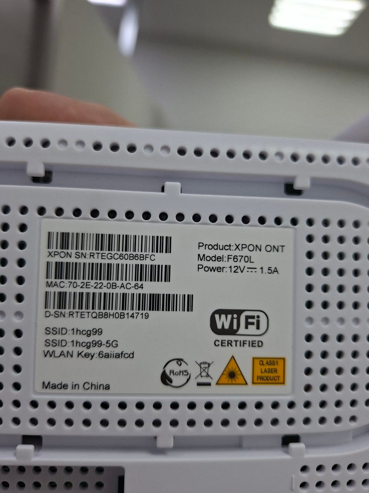
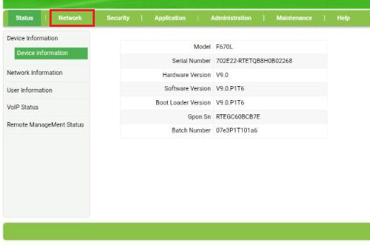
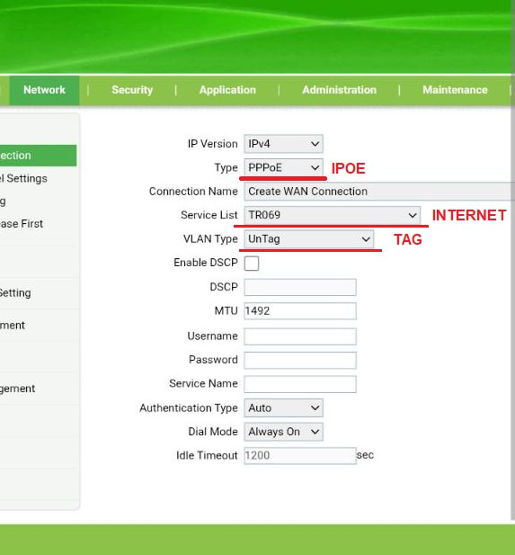
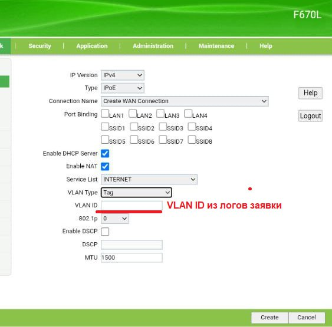
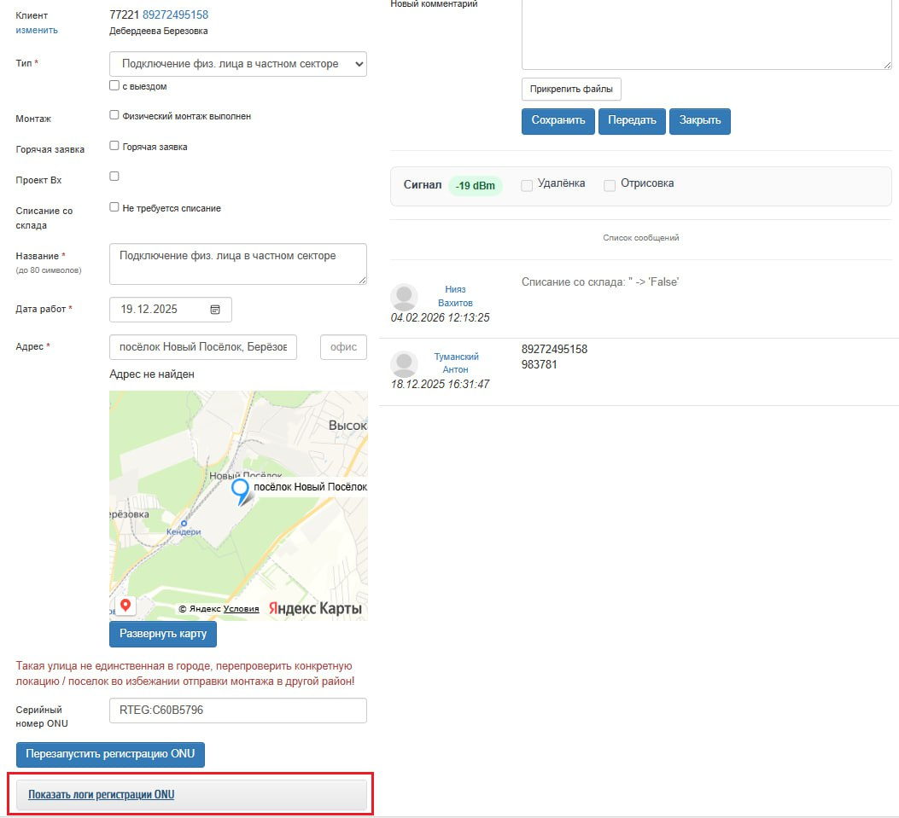
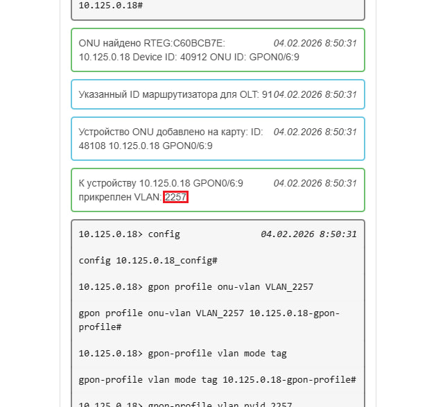
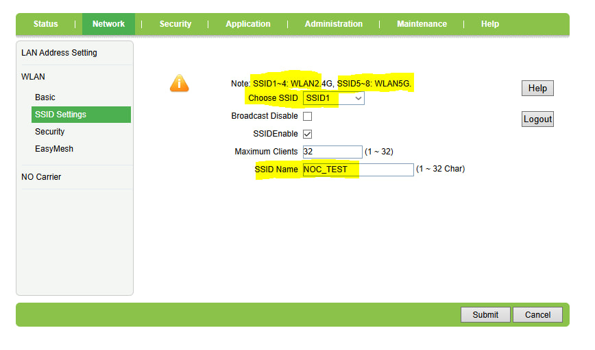
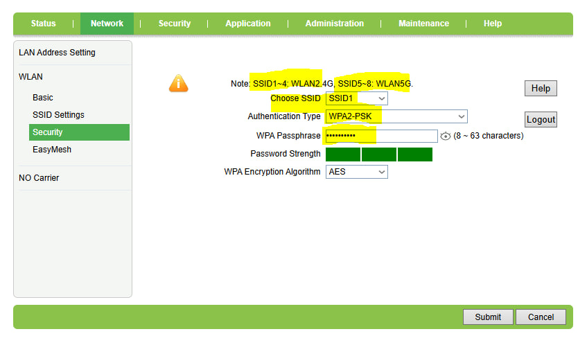
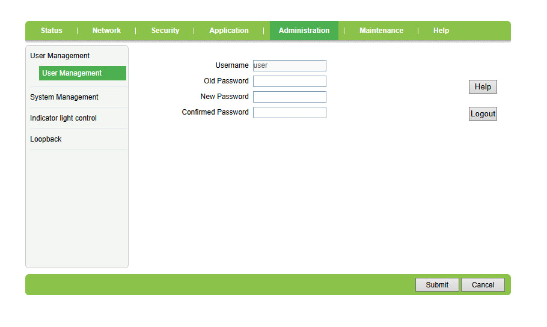
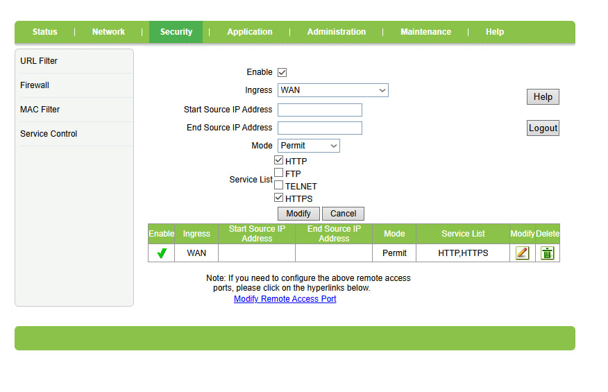

Подключаетесь к онушке по кабелею или вай-фаю (название сети и пароль на обратной стороне онушки) \

Для автопропа используете XPON SN для любй из трех F670L/F680/F899 (в данном случае это RTEGC60B6BFC)

Логин и пароль по умолчанию admin \
Переходите во вкладку Network - Device information \

VLAN ID берем из логов в заявке (!) (Илья доделает вашего бота так, что бы вам приходил как уровень сигнала, так и влан клеинта, в ответ на ваш запуск автопропа, пока это не сделают смотреть логи. У каждого клиента СВОЙ ИНДИВИДУАЛЬНЫЙ влан, не перепутайте) \

Где смотреть этот влан указано ниже \

### Настройка роутера, удаленки и пингов на XPON ONT F670L/F680/F899
перва наперво, нужно будет сменить логин и пароль для входа в лк и для пользователя user и для admin!
заходим по 192.168.1.1
логин и пароль: user
логин и пароль для админа: admin

следующие настройки делаются под user\
Настройка название вай фай сети: Network - WLAN - SSID Settings\
для сети 2.4 выбираете одну сеть Choose SSID: SSID 1-4, для сети 5 также одну из: SSID 5-8\
\
Настройка пароля для вай фая: Network - WLAN - SSID Settings\
выбираем Authentication Type: WPA2-PSK\
для сети 2.4 выбираете одну сеть Choose SSID: SSID 1-4, для сети 5 также одну из: SSID 5-8\
\
Для смены пароля входа в лк: Administration - User Management\
\
Настройка удаленного доступа  и пингов (она должна быть по умолчанию, но проверьте)\
